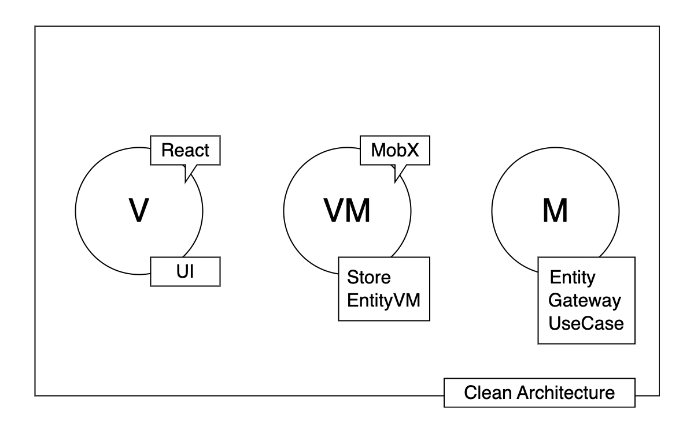

# React Clean Architecture
React プロジェクトで Clean Architecture を利用するサンプルリポジトリです。  
頻繁に変更が入る UI や API との通信などと疎結合にすることで、アプリケーションの変更耐性を上げ、ビジネスロジックを守る試みです。

## コンセプト
### 概念図


### 概要
MVVM をベースに詳細部分を Clean Architecture で実装する形になっています。  
ひとことに MVVM と言っても M などは特に漠然としており、そういった部分に Clean Architecture の概念が活用されているようなイメージです。

#### 役割
役割の概要は下記の通りです。
- **UI**: ユーザーインターフェースを提供
- **Store**: アプリケーション全体の状態管理の提供、及び EntityVM を格納して UI に提供
- **EntityVM**: Entity を表示用に加工する
- **Entity**: エンティティのデータを管理するシンプルなオブジェクト
- **Gateway**: API など外部とのやりとりを行う
- **UseCase**: ビジネスロジック

### Store
アプリケーション全体の状態管理と、EntityVM を UI に提供する役割を持ちます。

上記の概念図の VM 以降の Model 寄りの部分は、基本的に DI する形になっており、 Store は DI のコンポジションルートの役割があります。

Store や EntityVM などの VM の部分には [MobX](https://github.com/mobxjs/mobx) を利用しています。  

`src/stores` と `src/core/stores` の2つのディレクトリがあります。  
実際にはこのレポジトリでは Create React App で出来たものに `src/core` のディレクトリを突っ込んだ形なので、あんまりどちらに置いても変わらないですが、設計時に念頭に置いたのは下記の内容になります。

`src/core/stores` の方は UI に依存しない Store を格納し、  
`src/stores` の方は UI に依存する Store ようなイメージで分けています。

UI に依存しないというと、ちょっと語弊がありそうですが、例えば monorepo で React と React Native のプロジェクトがあるようなケースで、どちらでも使える Store が `src/core/stores` に入っており、React プロジェクト専用のものが `src/stores` のような形です。  

このレポジトリは Create React App ベースなので React プロジェクト向けの Store が `src/stores` に置いてあり、わかりづらいですが、 `src/core` の方を React プロジェクトに依存させず、いつでも切り出せるようにしたかった意図があります。

```sh
# monorepo のケースのイメージ
.
├── core
│   └── stores # UI に依存せず利用できるもの
├── mobile
│   └── stores # モバイル向けの Store と DI のコンポジションルート
└── web
    └── stores # Web 向けの Store と DI のコンポジションルート

```

React アプリケーション向けの Store も、core の Store も必要に応じて DI の設定で柔軟に差し替えられる想定です。

Store は Singleton で DI します。

### EntityVM
後述の Entity を表示し、Entity の操作を受け付ける VM です。  
あんまり良い名前が思いつかなかったので EntityVM にしてありますが、VM として利用する Entity の Decorator のようなイメージです。  
専用の Factory から生成します。

### Entity
その名の通りエンティティです。  
このレポジトリでは型定義で楽をするために GraphQL の API から取ってきたものをそのまま利用していますが、原理主義的に実装する場合はアプリケーション用に加工しても良いかもしれません。

エラーハンドリングや UseCase の出力用のクラスもこちらに含めています。

### Gateway
API や Storage など外部サービスとのやりとりを行います。  

型定義自体は `Service` としてより細かい粒度で定義しています。  
例えば、Todo 管理機能と Calendar 機能を提供する API を管理する AppAPIGateway というクラスがあったとして、  
型定義は `TodoService` と `CalendarService` のようになるイメージです。  
これによって、フロントとサーバーが同時期に開発になる際などに、Todo 機能は出来ているけど、Calendar 機能が出来ていないというようなケースで、どちらかだけをモックしたり出来ます。  
また、マイクロサービス化などを行って機能が別サーバーになってしまったようなケースでも優位性を発揮します。

### UseCase
ビジネスロジックを書きます。  
`UseCase` として型や `interaface` を定義して、`Intaractor` クラスとして実装します。  
Todo アプリで Todo を追加する動作に対して `AddTodoInteractor` を作成するようなイメージです。  

`UseCaseOutput` にエラー情報などが含まれるので UI で受け取って、メッセージを表示するなどの UI 向けのハンドリングを行います。

開発時には頻繁に追加する上に、必要なファイル数が多いのでスキャフォールディングスクリプトを利用します。

## ディレクトリ構成

```sh
.
├── plopTemplates # スキャフォールディング用のテンプレート
├── plopfile.js # スキャフォールディング用の設定ファイル
├── public
├── src
│   ├── App.tsx
│   ├── components
│   ├── core # Clean Architecture の UI に依存しない部分の処理が入るディレクトリ
│   │   ├── entities
│   │   │   ├── AppError.ts # エラーハンドリング用のクラス
│   │   │   └── UseCaseOutput.ts # UseCase の出力用のクラス
│   │   ├── entityVMs
│   │   │   ├── BaseEntityVM.ts # EntityVM の基底クラス
│   │   │   ├── TodoListVM.ts
│   │   │   └── TodoVM.ts
│   │   ├── factories
│   │   │   ├── entities # Entity のファクトリ
│   │   │   │   ├── AppErrorFactory.ts
│   │   │   │   └── UseCaseOutputFactory.ts
│   │   │   └── entityVMs
│   │   │       ├── TodoListVMFactory.ts
│   │   │       └── TodoVMFactory.ts
│   │   ├── gateways
│   │   │   ├── AppGraphQLAPIGateway.ts
│   │   │   ├── graphql
│   │   │   ├── lib
│   │   │   └── schema.graphql
│   │   ├── stores # UI に依存しない Store を格納するディレクトリ
│   │   ├── symbols # DI 用の Symbol を格納するディレクトリ
│   │   ├── types # 型定義
│   │   │   ├── entities.ts
│   │   │   ├── entityVMs
│   │   │   ├── factories
│   │   │   ├── services # 外部サービス（API や Storage など）を利用する Gateway など向けの型定義
│   │   │   ├── stores
│   │   │   └── useCases # useCase の型定義
│   │   └── useCases # Interactor を格納するディレクトリ
│   ├── hooks
│   ├── index.tsx
│   ├── inversify.config.ts # DI コンテナの設定ファイル
│   ├── mocks
│   ├── react-app-env.d.ts
│   ├── stores # React でのみ利用する Store や React と core の Store を糊付けする処理を格納するディレクトリ
│   └── utils
├── tsconfig.json
└── tsconfig.paths.json

```

## スキャフォールディング
以下の要領でスキャフォールディングを行います。  
ファイル数が多くなるのでスキャフォールディングがあると便利です。  

```sh
# UseCase & Interactor のスキャフォールディング
npm run g UseCase 

# FetchTodosUseCase や FetchTodosInteractor を生成する例。
? What is your UseCase name? FetchTodos
? ./useCases/{path please} TodoLists
✔  ++ /useCases/TodoLists/FetchTodosInteractor.ts
✔  _+ /symbols/index.ts
✔  ++ /types/useCases/todoLists.ts
✔  _+ /types/useCases/todoLists.ts

# EntityVM & Factory のスキャフォールディング
npm run g EntityVM

# TodoVM や TodoVMFactory を生成する例。
? What is your EntityVM name? Todo
? ./entityVMs/{path please} todoLists
✔  ++ /entityVMs/todoLists/TodoVM.ts
✔  ++ /factories/entityVMs/todoLists/TodoVMFactory.ts
✔  _+ /symbols/index.ts
✔  _+ /types/entityVMs.ts
✔  _+ /types/factories.ts

```
